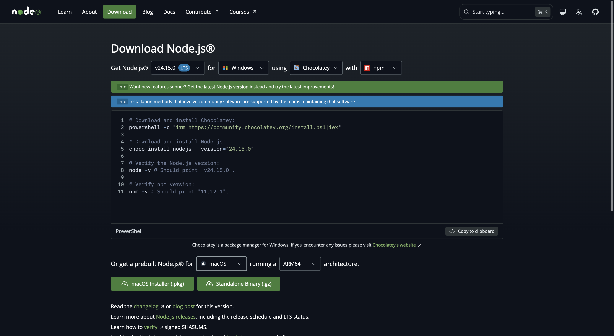
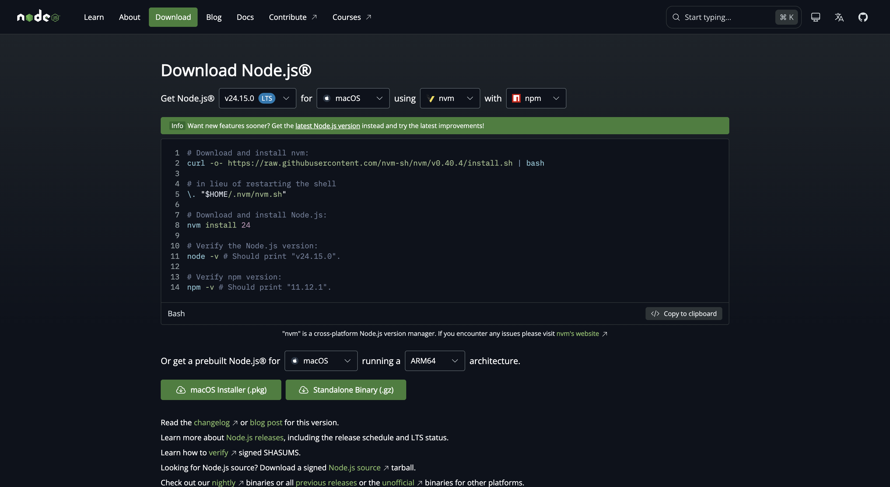

# AI Agent Environment Setup

Cross-platform setup kit for AI agent environments. Installs Python (via uv) and Claude Code CLI with one command - on Windows and Mac.

## What gets installed

| Tool | Purpose |
|------|---------|
| [uv](https://docs.astral.sh/uv/) | Python version + package manager |
| Python 3.12 | Runtime for AI scripts and automations |
| [Claude Code CLI](https://claude.ai/code) | AI agent in your terminal |
| Playwright *(optional)* | Browser automation |

---

## Step 1 - Install Node.js

Node.js is the only thing you need to install manually. The setup script handles everything else.

### Windows

1. Go to [nodejs.org/en/download](https://nodejs.org/en/download) - select **Windows**



2. Scroll down to **"Or get a prebuilt Node.js® for"** - click **Windows Installer (.msi)**
3. Run the installer, click through - all defaults are fine
4. Open **Command Prompt** (`Win + R` → type `cmd` → Enter)
5. Verify: `node --version` should print something like `v24.x.x`

> Windows installer and cmd screenshots to be added - take them on a Windows machine.

---

### Mac

1. Go to [nodejs.org/en/download](https://nodejs.org/en/download) - macOS is selected by default



2. Scroll down to **"Or get a prebuilt Node.js® for"** - click **macOS Installer (.pkg)**
3. Run the `.pkg` installer, click through
4. Open **Terminal** (Spotlight: `Cmd + Space` → type `Terminal`)
5. Verify: `node --version`

**Option B - Homebrew**

```bash
brew install node
```

---

## Step 2 - Clone this repo

```bash
# Windows (Command Prompt) or Mac (Terminal):
git clone https://github.com/YOUR_USERNAME/ai-setup-kit.git
cd ai-setup-kit
```

No git? Download the ZIP from GitHub → Extract → open folder in terminal.

---

## Step 3 - Run setup

```bash
node setup.js
```

The script will:
1. Install `uv` (Python manager)
2. Install Python 3.12
3. Install Claude Code CLI
4. Ask if you want Playwright (browser automation) - optional

> Screenshot: run on your machine once and capture the terminal output.

---

## Step 4 - Start Claude Code

Open a **new** terminal window (important - so PATH updates take effect), then:

```bash
claude
```

Follow the login prompt to connect your Anthropic account.

> Screenshot: capture on first run.

---

## Troubleshooting

**`node` not found after install (Windows)**
Close and reopen Command Prompt. The PATH only updates in new windows.

**`uv` not found after setup**
Close and reopen your terminal, then run `uv --version` to verify.

**Permission error on Mac**
Run with: `sudo node setup.js`

**Playwright install fails**
Run manually after setup:
```bash
uv pip install playwright
uv run playwright install chromium
```
